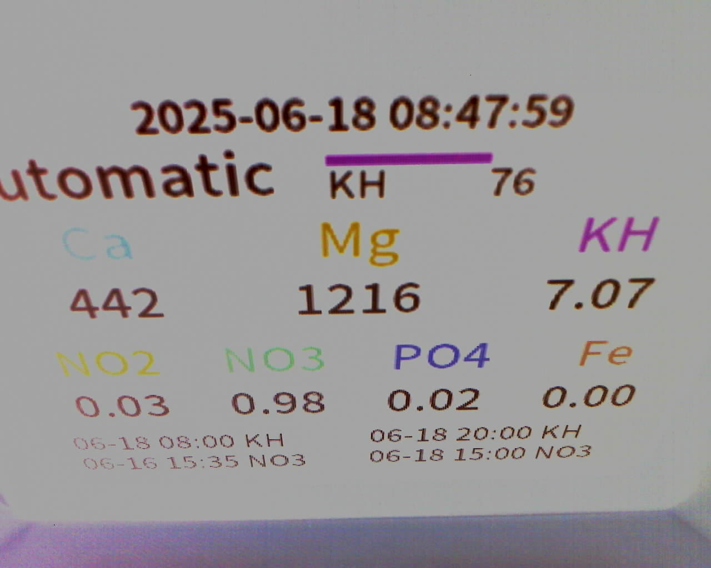
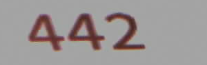
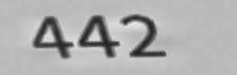
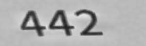

# reef_master_spa_2_ha
reef master spa to home assistant importer


The goal of this project is to give a basic guidance on how to setup an esp32 cam to grab the screen from reef master spa, do OCR, and send data to home assistant!


Now, it's required that you are familiar with a certain concepts like
1 - arduino ide OR platform.io and how to flash an esp32 board
2 - how to setup docker OR python
3 - have HA installed and know how to interact with it :)


## STEP 0

clone the repo :)


## STEP 1

grab an esp32-cam board, i am using this one (from amazon, aliexpress LOOK the same but i can't confirm)
[ESP32 CAM Camera Module OV5640 Amazon it](https://www.amazon.it/dp/B0DXFF1GKV)
[ESP32 CAM Camera Module OV5640 aliexpress](https://www.aliexpress.com/item/1005007234963618.html)

now, on the esp32 folder you find the program that need to be uploaded to this board. 
7/
before you proceed change wifi settings to match your needs in [arduino/main.cpp](https://github.com/ramarro123/reef_master_spa_2_ha/blob/b7876e6f92e96fe249d5a62a347671c6a5dcf474/arduino/main.cpp#L53)


```
  wifiMulti.addAP("wifi1", "aaa");
  wifiMulti.addAP("wifi2", "bbb");
```

Also, it worth nothing to say that if you use a different board and/or different camera, the above code won't work, and you need to play with it, probably to change the board type & pin of the camera.

This code is 99% the one shipped with esp32_cam project, so you can refer to that for help, as i won't be able to assist (i simply don't have other camera aside the one i linked here)

## STEP 2

print the 2 stl file on "stl" folder, this are the support for your board, when you finish it should look like that
<insert image here>


## STEP 3

put the board on the support, turn it on, connect to ip address and regulate the various parameter. parameters aren't stored, so if you reboot you are gonna loose them
write them down, rebuild your esp32 firmware setting your preferred default from here
```
  // EXTRA CONFIG
  Serial.println("Apply my personal preference");
```

the list you see is the one that work in my environment, it should be the same for you hopefully

this is a screenshot of how control should appear, just play with them, hit "get still" and check if the image is good for you


## STEP 4

you have 2 option here, 1 is to use docker (Dockerfile included in python folder) or run directly the extract script.
my suggestion is to go with docker, in the same host of home assistant, so you can leave it running forever without bothering.
in any case you need to have opencv, easyocr, requests and numpy


## STEP 5

run your extract code, and check the images!
when you run extract code, you got some "debug" png that help you to figure out what's going on.
an example is in "data" folder here in github.

with this images, you can check if the webcam is aligned in the same way of mine (if not you can modify offset form extract.py) and if the pre processing
of the image is giving good results. 

this is how the data got extracted

and then analized in various step





this is the final step, the one used by OCR, if this is good, normally OCR result will be good :)


In case of help, you can reach me on this thread in reef2reef https://www.reef2reef.com/threads/kamoer-reef-master-spa-ha-integration.1116295/#post-13661376 adding the debug image
and we can try to find a way to help you!


